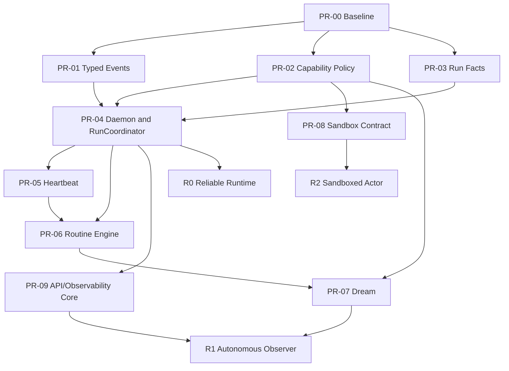

# Synapsis Agent Runtime
## Product Requirements, Delivery Plan, and Implementation Task Breakdown

**Repository:** `gsmlg-opt/Synapsis`  
**Reviewed baseline:** `main@0d6cc714ec16b34c8c191f158fe82c8a6ef08cf8`  
**Review date:** 2026-09-03  
**Document status:** Implementation-ready draft  
**Primary audience:** Codex implementation workers and human reviewers  
**Related documents:**

- `docs/agent-runtime/BASELINE.md` (implementation baseline freeze for Track A+)
- `docs/decisions/ADR-006-in-process-sessions-and-concord-storage.md`
- Supersedes removed `SYNAPSIS_AGENT_DAEMON_DESIGN_FOR_CODEX.md`

---

## 1. Executive Decision

Synapsis should **not** pursue OpenClaw feature parity.

The product target is a reliable, long-running, local agent runtime that can:

1. accept manual work;
2. use tools under a single capability policy;
3. perform cheap daemon liveness checks;
4. run LLM-backed heartbeat routines;
5. run bounded dream/reflection routines;
6. execute scheduled routines;
7. persist run facts and recover coherently after process or node restarts;
8. expose enough status and history for an operator to understand what happened.

The target is:

> Synapsis runs one logical local agent control plane. Each unit of work executes in its own supervised run process, uses the existing session and model/tool runtime, records typed events, and terminates with an explicit outcome.

The target is **not**:

- an OpenClaw gateway-protocol clone;
- a chat-channel aggregation product;
- a device pairing or mobile-node platform;
- a compatibility layer for OpenClaw tool names;
- an orchestration system for other coding-agent products;
- a replacement for the existing Synapsis session engine with a second agent loop.

### 1.1 Delivery strategy

Delivery is split into three release gates:

| Gate | Product capability | Mutation policy |
|---|---|---|
| **R0 — Reliable Runtime** | Manual daemon runs, typed outcomes, run history, cancellation, restart reconciliation | Read-only tools only |
| **R1 — Autonomous Observer** | Heartbeat, dream, scheduled routines, failure history, no-overlap and idempotent occurrences | Read-only and tightly scoped reflection writes |
| **R2 — Sandboxed Actor** | Autonomous file mutation and shell execution | Only through a real isolation backend and explicit capability grants |

This ordering is intentional. Autonomous mutation must not be enabled before authorization and sandbox boundaries are enforceable.

---

## 2. Source Basis and Current-State Corrections

The attached analysis established the correct product reduction: one supervised agent daemon with tool use, heartbeat, dream/reflection, and scheduled work. That framing remains the product basis.

Several implementation assumptions in earlier material are now outdated relative to the reviewed repository state. This document applies the following corrections.

### 2.1 Preserve ADR-006

This work must preserve ADR-006:

- sessions remain node-local;
- Concord remains the embedded coordination store;
- PostgreSQL and Oban must not be reintroduced;
- graph/runtime transitions should remain reducer-oriented;
- schedules remain node-local;
- current session supervision and per-session task supervision remain the execution foundation.

### 2.2 `AgentRun` already exists

`Synapsis.AgentRun` is already implemented as an embedded node-local coordination schema, and `Synapsis.Agent.Runs` persists it under the Concord coordination namespace.

Therefore:

- do not add an Ecto `agent_runs` table;
- extend the current embedded run model;
- repair persistence/error semantics;
- add typed event sequencing and recovery metadata;
- make the run state the authoritative lifecycle projection for daemon work.

### 2.3 Do not add an Ecto `Heartbeats` context

The current scheduler loads TOML heartbeat definitions and still contains an obsolete fallback to `Synapsis.Heartbeats`. Under ADR-006, the correct action is to remove the database fallback and make configuration failure visible—not to restore an Ecto context.

### 2.4 Do not introduce Oban

The generic routine engine must evolve from the current node-local scheduler. Runtime occurrence state belongs in Concord coordination keys; routine definitions remain file/config based.

### 2.5 Do not make the daemon a serial executor

`Synapsis.Agent.Daemon` is a logical control plane, not a process that performs all LLM and tool work in its own mailbox.

Every run executes under a `DynamicSupervisor` through a dedicated `RunCoordinator`. The daemon owns admission, trigger routing, status projection, and reconciliation.

### 2.6 Reuse the existing execution engine

The daemon path must use the existing session runtime, graph runtime, QueryLoop, provider registry, and tool registry. It must not create a second independent agent engine.

---

## 3. Problem Statement

Synapsis can already run interactive sessions and invoke tools, but it does not yet provide one reliable lifecycle for unattended or long-running agent work.

The current implementation has these systemic gaps:

1. `Synapsis.Agent.Supervisor` starts a run registry but no permanent daemon or per-run supervisor.
2. Heartbeat completion waits for internal tuple messages that the session completion node does not emit.
3. `SessionBridge` subscribes one process to PubSub and waits for those messages in a different process.
4. Heartbeat execution can turn a timeout or send failure into an error Markdown document and still record the heartbeat as completed.
5. The local scheduler repeatedly cancels and recreates timers, launches untracked tasks, and has no occurrence identity, no-overlap rule, misfire policy, retry state, or restart reconciliation.
6. QueryLoop can call `execute_approved/3` directly, bypassing the ordinary permission path.
7. Missing session/policy context can fail open.
8. The current `ask` profile allows destructive non-bash tools without approval.
9. Run persistence errors are swallowed; run-event persistence is best-effort even for lifecycle facts.
10. The current sandbox application is a Port/JSON-RPC bridge, not operating-system isolation.
11. Health checks report process presence more than actual runtime readiness.

As a result, Synapsis can appear healthy while autonomous work is timing out, bypassing policy, duplicating scheduled execution, or losing lifecycle facts.

---

## 4. Product Scope

### 4.1 In scope

- permanent supervised daemon control plane;
- one supervised coordinator per run;
- manual daemon-submitted work;
- typed internal run/session completion protocol;
- authoritative node-local run lifecycle;
- cancellation, deadlines, timeout outcomes, and restart reconciliation;
- one authorization path for all tool calls;
- read-only autonomous tool profiles;
- daemon liveness heartbeat;
- LLM-backed heartbeat routines;
- dream/reflection routines;
- generic scheduled routines;
- deterministic routine occurrence identity;
- no-overlap, misfire, retry, backoff, and failure streak policies;
- status, run history, routine management, event observation, and telemetry;
- real sandbox contract and a Linux isolation backend before autonomous mutation.

### 4.2 Explicitly out of scope

- OpenClaw channels, gateway protocol, device pairing, voice, Canvas, or mobile nodes;
- Slack, Telegram, WhatsApp, Discord, or equivalent chat integration;
- multi-node run ownership or distributed singleton election;
- remote workspace execution;
- Samgita integration;
- Backplane integration changes;
- MCP resource-count redesign;
- replacement of the existing interactive web session flow;
- PostgreSQL, Ecto persistence, or Oban;
- fully autonomous destructive actions;
- an additional agent loop parallel to the existing graph/QueryLoop runtime.

---

## 5. Product Outcomes

### 5.1 Operator outcomes

An operator can:

- see whether the daemon is live and ready;
- submit a bounded manual run;
- see queued, active, blocked, failed, completed, timed-out, cancelled, and uncertain runs;
- inspect run events, tool calls, model/provider selection, policy snapshot, and result summary;
- cancel a run;
- trigger heartbeat or dream manually;
- configure and inspect scheduled routines;
- understand why a routine did not execute;
- distinguish execution failure from delivery/notification failure;
- restart Synapsis without silently replaying uncertain side effects.

### 5.2 Runtime outcomes

The runtime can:

- isolate run crashes under OTP supervision;
- convert every trigger into one common run pipeline;
- enforce one capability policy before every tool execution;
- preserve lifecycle facts or return a visible storage error;
- avoid duplicate scheduled occurrences;
- avoid overlapping runs when configured;
- reconcile incomplete runs after restart;
- fail closed when context or policy is missing;
- expose sufficient metrics to detect stuck or degraded operation.

---

## 6. Target OTP Architecture

```text
Synapsis.Agent.Supervisor
├── Synapsis.Agent.Runtime.RunRegistry
├── Synapsis.Agent.RunSupervisor             DynamicSupervisor
├── Synapsis.Agent.Daemon                    permanent control plane
└── Synapsis.Agent.RoutineScheduler          node-local scheduler

Synapsis.Agent.RunSupervisor
└── Synapsis.Agent.RunCoordinator            one process per run
    ├── creates or attaches one session
    ├── sends the run prompt
    ├── receives typed session/run events
    ├── applies the run-state reducer
    ├── enforces deadline and cancellation
    ├── records lifecycle events
    └── emits public projections

Existing session subtree
└── Session.Supervisor
    ├── per-session Task.Supervisor
    └── Session.GenServer
        ├── graph / QueryLoop
        ├── provider streaming
        └── tool dispatch through CapabilityPolicy
```

### 6.1 `Synapsis.Agent.Daemon`

Responsibilities:

- initialize the runtime status projection;
- reconcile unfinished runs and occurrences on boot;
- accept manual and system triggers;
- perform admission checks;
- generate or validate `run_id` and `idempotency_key`;
- create a queued run fact;
- start a `RunCoordinator` under `RunSupervisor`;
- route cancellation requests;
- expose a stable status snapshot;
- emit a cheap liveness pulse;
- never perform long-running model or tool work in its GenServer callback.

Suggested public API:

```elixir
Synapsis.Agent.Daemon.status()
Synapsis.Agent.Daemon.submit(prompt, opts)
Synapsis.Agent.Daemon.trigger(:heartbeat, routine_id, opts)
Synapsis.Agent.Daemon.trigger(:dream, routine_id, opts)
Synapsis.Agent.Daemon.trigger(:schedule, routine_id, opts)
Synapsis.Agent.Daemon.cancel(run_id, reason \\ :operator_request)
Synapsis.Agent.Daemon.reconcile()
```

### 6.2 `Synapsis.Agent.RunSupervisor`

A `DynamicSupervisor` that owns one `RunCoordinator` per active run.

Rules:

- run IDs are the process identity;
- duplicate start for an active run returns the existing PID or an idempotent success;
- coordinator failure is visible to the daemon;
- a restarted coordinator must read the current run projection before deciding whether it can continue;
- terminal runs are not restarted.

### 6.3 `Synapsis.Agent.RunCoordinator`

The coordinator is an orchestration boundary, not a second agent engine.

Responsibilities:

- transition `queued -> starting -> running`;
- create or attach the session used for execution;
- subscribe to typed internal events in its own process;
- submit the prompt;
- correlate session and tool events to the run;
- enforce deadline and cancellation;
- persist terminal outcome exactly once;
- classify restart outcomes;
- stop normally after terminal completion.

### 6.4 Functional state transition core

Run transitions should be implemented as a pure reducer:

```text
reduce(run_state, run_event) -> {:ok, new_state} | {:error, invalid_transition}
```

The coordinator performs effects around the reducer:

```text
receive event
  -> validate and reduce
  -> persist critical event/projection
  -> emit PubSub/telemetry projection
  -> perform next effect
```

The reducer must not call providers, tools, stores, PubSub, or clocks directly.

---

## 7. Run Domain Model

### 7.1 Run kinds

```text
manual
heartbeat
dream
schedule
```

A daemon liveness pulse is not an LLM run and should not create an `AgentRun` unless a diagnostic incident is produced.

### 7.2 Run states

Existing states should be retained and extended:

```text
queued
starting
running
waiting_approval
sleeping
completed
failed
cancelled
timed_out
unknown_outcome
```

Terminal states:

```text
completed
failed
cancelled
timed_out
unknown_outcome
```

`unknown_outcome` is required when Synapsis cannot determine whether a non-idempotent side effect completed before a crash.

### 7.3 Allowed transition outline

```text
queued
  -> starting
  -> cancelled
  -> failed

starting
  -> running
  -> cancelled
  -> failed
  -> timed_out

running
  -> waiting_approval
  -> sleeping
  -> completed
  -> failed
  -> cancelled
  -> timed_out
  -> unknown_outcome

waiting_approval
  -> running
  -> failed
  -> cancelled
  -> timed_out

sleeping
  -> running
  -> failed
  -> cancelled
  -> timed_out

terminal
  -> no further transition
```

A repeated terminal event must be treated as an idempotent duplicate when it has the same event identity; a contradictory terminal event is an invariant violation.

### 7.4 `AgentRun` extensions

Extend the existing embedded schema rather than adding a database table.

Required fields after this project:

```text
id
kind
source
status
assistant_name
project_ref
workspace_ref
session_id
routine_id
parent_run_id
attempt
idempotency_key
scheduled_for
deadline_at
tool_profile
policy_snapshot
capability_snapshot
model
provider
summary
error
failure_class
recovery_state
started_at
finished_at
last_event_sequence
revision
metadata
inserted_at
updated_at
```

Notes:

- preserve decoding compatibility with existing stored run values;
- new fields require defaults during decode;
- retain old `source` values for compatibility, but introduce `scheduler` as the normal source for node-local routine runs;
- do not trust mutable global configuration after run start: store a policy/capability snapshot in the run.

### 7.5 Run event envelope

Introduce a typed internal envelope:

```text
RunEvent
  event_id
  run_id
  sequence
  type
  schema_version
  occurred_at
  payload
  causation_id
  correlation_id
```

Minimum lifecycle event types:

```text
run.created
run.starting
run.started
run.waiting_approval
run.resumed
run.sleeping
run.completed
run.failed
run.cancelled
run.timed_out
run.unknown_outcome
run.reconciled
```

Execution event types:

```text
session.created
session.started
session.completed
session.failed
tool.requested
tool.authorized
tool.denied
tool.started
tool.completed
tool.failed
approval.required
approval.resolved
provider.started
provider.completed
provider.failed
```

Routine event types:

```text
routine.evaluated
routine.occurrence_created
routine.triggered
routine.skipped
routine.retry_scheduled
routine.failure_streak_changed
heartbeat.liveness
heartbeat.completed
dream.completed
```

### 7.6 Durability classes

Not every event needs the same guarantee.

**Critical events** must return a storage result and block the state transition on failure:

- run creation;
- run start;
- approval state;
- terminal outcome;
- routine occurrence claim;
- cancellation intent;
- uncertain-side-effect marker.

**Observational events** may be best-effort, provided loss does not change lifecycle meaning:

- incremental token counts;
- UI typing indicators;
- verbose tool progress;
- intermediate model chunks.

PubSub is a projection and transport mechanism. It is not the lifecycle source of truth.

---

## 8. Routine Domain Model

### 8.1 Routine definitions

Definitions remain file/config based and should converge on one normalized structure:

```text
id
name
kind                    heartbeat | dream | schedule
scope                   global | project
project_ref
enabled
schedule                cron or interval
timezone
prompt
tool_profile
capability_overrides
no_overlap
max_runtime_ms
misfire_policy
retry_policy
notify_user
keep_history
metadata
```

The existing heartbeat configuration can remain the first concrete adapter. Generic routine configuration should be introduced without requiring an immediate migration of every heartbeat file.

### 8.2 Runtime routine state

Store mutable scheduler state in Concord coordination keys, not in TOML:

```text
coord/routines/<routine_id>/state
coord/routine_occurrences/<routine_id>/<occurrence_key>
```

Routine state includes:

```text
last_evaluated_at
last_scheduled_at
last_started_at
last_completed_at
next_run_at
last_run_id
failure_streak
backoff_until
last_error
```

Occurrence state includes:

```text
occurrence_key
routine_id
scheduled_for
status
run_id
attempt
claimed_at
started_at
finished_at
outcome
error
```

### 8.3 Occurrence identity

Use a deterministic key derived from the routine and logical schedule time:

```text
<routine_id>:<scheduled_for-in-UTC>
```

Persist the occurrence before starting a run. On restart, the scheduler checks the deterministic key before triggering work.

Because scheduling is node-local and the scheduler is a uniquely named GenServer, this design does not require distributed leases. It still requires atomic local writes and deterministic reconciliation.

### 8.4 Scheduling policies

Required policies:

```text
no_overlap: true | false
misfire_policy: skip | run_once
retry_policy:
  max_attempts
  initial_backoff_ms
  max_backoff_ms
  multiplier
failure_alert_after
max_runtime_ms
timezone
```

Defaults:

- `no_overlap: true`;
- `misfire_policy: skip`;
- bounded exponential retry;
- explicit maximum runtime;
- UTC when timezone is omitted;
- new autonomous routines disabled until explicitly enabled.

---

## 9. Functional Requirements

### Runtime lifecycle

**FR-001 — Permanent daemon**  
The agent daemon is a permanent supervised process and never exits because of user inactivity.

**FR-002 — Per-run isolation**  
Every active run has one supervised `RunCoordinator`; model/tool execution cannot block the daemon mailbox.

**FR-003 — Common execution path**  
Manual daemon work, heartbeat, dream, and schedule triggers all create an `AgentRun` and use the same coordinator/session lifecycle.

**FR-004 — Typed terminal protocol**  
Internal consumers receive typed, versioned completion/failure events rather than parsing UI event strings or transcript content.

**FR-005 — Exactly one terminal outcome**  
A run reaches one terminal status. Duplicate delivery of the same event is idempotent; contradictory terminal transitions are rejected and logged as invariant violations.

**FR-006 — Failure is not content**  
A timeout, session-create failure, send failure, provider failure, tool failure, or storage failure cannot be converted into a successful run merely because an error report was rendered as text.

**FR-007 — Cancellation and deadline**  
The operator and runtime can cancel a run. Every autonomous run has a deadline. Cancellation/deadline propagation reaches session/model/tool tasks as far as the current runtime permits.

**FR-008 — Restart reconciliation**  
At boot, the daemon classifies incomplete runs as resumable, failed, timed out, or unknown outcome. It must never blindly replay a side effect whose outcome is uncertain.

### Tool authorization

**FR-009 — One authorization gateway**  
Every tool invocation—graph, QueryLoop, streaming, heartbeat, dream, and scheduled work—passes through the same capability-policy function.

**FR-010 — Fail closed without context**  
Missing session, policy snapshot, project, or workspace context does not imply approval. The invocation is denied unless an explicit system policy authorizes it.

**FR-011 — No public approval bypass**  
`execute_approved/3` is removed from ordinary call sites or requires an opaque grant produced by the policy layer. Callers cannot assert approval by choosing a different function.

**FR-012 — Unattended approval behavior**  
An unattended run executes only capabilities pre-authorized in its policy snapshot. A new approval requirement causes a structured failure or blocked outcome; it never waits indefinitely.

**FR-013 — Policy snapshot**  
Each run records the effective tool profile, capability overrides, provider/model selection, and relevant limits at admission time.

### Heartbeat and routines

**FR-014 — Liveness heartbeat**  
The daemon emits a cheap liveness/status pulse without invoking an LLM.

**FR-015 — Agent heartbeat routine**  
An LLM-backed heartbeat runs through the ordinary run lifecycle and records a real success or failure.

**FR-016 — Execution/delivery separation**  
Heartbeat and routine results distinguish execution status from optional report delivery or notification status.

**FR-017 — Deterministic routine occurrence**  
Every logical schedule occurrence has a deterministic identity and can create at most one run.

**FR-018 — No-overlap and misfire**  
The scheduler enforces per-routine no-overlap and the configured misfire policy.

**FR-019 — Retry and failure streak**  
Transient failures use bounded backoff. Repeated failures update a visible failure streak and do not generate retry storms.

**FR-020 — Scheduler reconciliation**  
The scheduler persists sufficient state to reconstruct pending/claimed occurrences after restart.

### Dream/reflection

**FR-021 — Bounded reflection input**  
Dream reads a bounded window of recent runs, failures, session summaries, tool outcomes, todos, and memories.

**FR-022 — Structured dream output**  
Dream produces a structured result containing summary, durable-memory candidates, unresolved tasks, risks, suggested routines, and ignored/noise items.

**FR-023 — Conservative default capabilities**  
Dream cannot execute shell commands or mutate project files by default. It may write only to specifically scoped memory/todo interfaces under the `reflect` profile.

### Product surfaces

**FR-024 — Runtime status**  
The server exposes liveness, readiness, daemon status, queue depth, active runs, stuck runs, last successful heartbeat, last dream, scheduler drift, and failure streaks.

**FR-025 — Run operations**  
The server exposes submit, list, get, cancel, and event-history operations for daemon runs.

**FR-026 — Routine operations**  
The server exposes list, get, create/update configuration, enable/disable, trigger-now, and history operations for routines, subject to the existing config storage model.

**FR-027 — Existing session compatibility**  
Current interactive LiveView/session behavior remains functional throughout the migration.

### Sandboxed mutation

**FR-028 — Real sandbox before autonomous mutation**  
Autonomous file writes, repository mutation, and shell execution remain disabled until a real OS isolation backend enforces filesystem, environment, network, process, and resource limits.

---

## 10. Non-Functional Requirements

**NFR-001 — Node-local correctness**  
The design must not depend on distributed locks, distributed process registries, or cross-node run ownership.

**NFR-002 — Storage error visibility**  
Critical Concord write failures must be returned to callers and surfaced in status/telemetry.

**NFR-003 — Bounded work**  
Every model call, tool call, run, approval wait, scheduler retry, and memory operation has a finite timeout or deadline.

**NFR-004 — Crash isolation**  
A failed run does not terminate the daemon or unrelated runs.

**NFR-005 — Idempotent control operations**  
Run submission and routine occurrence creation accept an idempotency key and safely handle retries.

**NFR-006 — Deterministic transitions**  
State transitions are unit-testable pure functions independent of clocks and effects.

**NFR-007 — Observable correlation**  
Logs, telemetry, events, sessions, tool calls, and routine occurrences include `run_id` and, where applicable, `routine_id` and `occurrence_key`.

**NFR-008 — Backward-compatible decoding**  
Existing embedded `AgentRun` values remain readable after schema extension.

**NFR-009 — No real model dependency in CI**  
Core lifecycle, scheduling, authorization, and recovery tests use deterministic provider/tool doubles.

**NFR-010 — Secure defaults**  
Autonomous routines are disabled by default; destructive capabilities are denied by default; missing policy context fails closed.

**NFR-011 — Current architecture preservation**  
No PostgreSQL, Ecto persistence, or Oban is introduced.

**NFR-012 — Performance isolation**  
Daemon status calls remain responsive while model and tool operations are in progress.

---

## 11. Capability and Tool Policy

### 11.1 Policy API

Introduce one pure policy boundary:

```text
CapabilityPolicy.evaluate(tool_call, policy_snapshot, execution_context)
  -> {:allow, capability_grant}
  -> {:approval_required, approval_request}
  -> {:deny, reason}
```

The execution boundary accepts a grant, not a caller-provided boolean:

```text
ToolGateway.execute(tool_call, execution_context, capability_grant)
```

A grant should be scoped to:

- `run_id`;
- tool name or tool class;
- normalized arguments or argument constraints;
- project/workspace;
- expiry;
- approval source.

### 11.2 Standard profiles

| Profile | Intended use | Default capability |
|---|---|---|
| `read_only` | Manual inspection and autonomous observation | File/repo/search/status reads only |
| `heartbeat` | Proactive checks | `read_only` plus bounded web/memory reads and result publication |
| `reflect` | Dream/reflection | `read_only` plus scoped memory/todo writes |
| `coding` | Interactive coding | File writes and shell require operator approval or explicit grant |
| `maintenance` | Explicit maintenance workflow | Narrow predeclared write/execute capabilities |
| `dangerous` | Exceptional manual operation | Never available to unattended routines |

### 11.3 Required semantic correction for `ask`

The existing `ask` behavior must not mean “allow every class, with special handling only for bash.”

Recommended semantics:

```text
read          -> allow
write         -> approval_required
execute       -> approval_required
destructive   -> deny unless explicitly granted
unknown       -> deny
```

### 11.4 Autonomous runs

For unattended heartbeat, dream, and schedule runs:

- there is no interactive approval loop by default;
- pre-authorized capabilities are captured at admission;
- a capability outside that envelope produces `approval_unavailable` or `capability_denied`;
- the run terminates or returns a structured blocked result according to routine policy;
- it must not remain in `waiting_approval` indefinitely.

---

## 12. Heartbeat Requirements

### 12.1 Daemon liveness

The liveness pulse is internal and cheap. It should report:

- daemon PID/uptime;
- run supervisor availability;
- queue depth;
- active coordinator count;
- scheduler status;
- Concord coordination-store write probe or recent-write status;
- provider and tool registry presence;
- stuck-run count;
- last successful routine heartbeat.

It must not invoke the LLM merely to prove the daemon is alive.

### 12.2 LLM-backed heartbeat routine

Execution flow:

```text
RoutineScheduler
  -> create/claim occurrence
  -> Daemon.trigger(:heartbeat, ...)
  -> create AgentRun
  -> start RunCoordinator
  -> execute through one session
  -> receive typed terminal event
  -> persist terminal outcome
  -> update occurrence and failure streak
  -> optionally deliver report
```

Required result model:

```text
execution_status: completed | failed | timed_out | cancelled | unknown_outcome
delivery_status: delivered | failed | skipped
summary
error
run_id
occurrence_key
```

A failed execution can still deliver an error notification, but delivery does not change the execution status.

### 12.3 Removal of current compatibility failures

The implementation must remove these behaviors:

- waiting for event shapes the session runtime never emits;
- transcript polling as the primary completion mechanism;
- representing execution errors only as Markdown content;
- broadcasting `heartbeat_completed` for a failed or timed-out run;
- swallowing configuration-load failures as an empty schedule without a degraded status;
- using the obsolete database-backed heartbeat fallback.

---

## 13. Dream/Reflection Requirements

### 13.1 Triggering

Dream can be triggered:

- manually;
- on a configured schedule;
- after a minimum idle interval;
- after a failure threshold, with cooldown.

The first implementation should support manual and scheduled triggers. Idle-trigger heuristics can follow once the lifecycle is stable.

### 13.2 Inputs

Bound and normalize inputs before calling the model:

- recent terminal run summaries;
- failed, timed-out, and unknown-outcome runs;
- recent session summaries, not full unbounded transcripts;
- relevant tool failures;
- current todos;
- recent memories;
- recent heartbeat results;
- project/repository status when a project scope is present.

### 13.3 Output contract

```text
DreamResult
  summary
  memory_candidates[]
  unresolved_tasks[]
  risks[]
  suggested_routines[]
  ignored_items[]
  source_run_ids[]
```

The first version stores the structured result and passes memory/todo candidates through existing scoped interfaces. It must not silently reinterpret a model response as executable work.

### 13.4 Tool profile

Default `reflect` capabilities:

```text
allowed:
  memory search/read
  scoped memory candidate save
  todo read
  scoped todo proposal/write
  session summary read
  run history read
  repository status
  file/list/grep/glob reads

denied:
  shell execution
  file write/edit/delete
  repository sync/reset/clean
  worktree removal
  unrestricted network mutation
```

---

## 14. Sandbox Requirements

The current sandbox bridge is a process/protocol integration layer. It must not be treated as an isolation guarantee.

### 14.1 Backend behavior

Introduce a sandbox backend contract with at least:

```text
prepare(spec)
execute(prepared, command_or_tool)
cancel(execution_id)
inspect(execution_id)
cleanup(prepared)
```

### 14.2 Sandbox specification

```text
workspace_mount: read_only | read_write | none
allowed_paths
environment_allowlist
secret_handles
network: none | allowlist | full
allowed_hosts
cpu_limit
memory_limit
pid_limit
wall_clock_timeout
output_limit
working_directory
```

### 14.3 Linux implementation gate

The first real backend should target Linux/NixOS and enforce:

- mount namespace isolation;
- explicit read-only/read-write workspace mounts;
- empty or controlled home directory;
- environment allowlist;
- no network by default;
- CPU, memory, PID, and wall-clock limits;
- process-group cancellation;
- canonical path and symlink validation.

The exact backend can use bubblewrap/systemd-run or a container runtime, but the behavior contract and tests are the acceptance authority.

### 14.4 Release policy

Before R2:

- autonomous profiles cannot receive file-write, repository-mutation, or shell capabilities;
- interactive coding can retain current behavior under explicit approval, but it must still use the unified policy gateway;
- any unsupported platform falls back to read-only autonomous operation, not unsandboxed mutation.

---

## 15. Control API and Observability

### 15.1 Health endpoints

```text
GET /live
GET /ready
GET /api/agent/status
```

`/live`:

- endpoint and BEAM are alive.

`/ready`:

- daemon registered;
- run supervisor available;
- coordination store writable or not degraded;
- scheduler initialized;
- tool/provider registries ready;
- boot reconciliation complete.

`/api/agent/status`:

- daemon uptime;
- queue depth;
- active runs;
- oldest queued age;
- stuck runs;
- incomplete reconciliation count;
- last successful heartbeat/dream;
- scheduler drift;
- routine failure streaks;
- storage degradation;
- sandbox capability status.

### 15.2 Run API

```text
POST   /api/agent/runs
GET    /api/agent/runs
GET    /api/agent/runs/:id
POST   /api/agent/runs/:id/cancel
GET    /api/agent/runs/:id/events
```

Submission accepts:

```text
prompt
assistant_name
project_ref
workspace_ref
tool_profile
provider/model override
max_runtime_ms
idempotency_key
metadata
```

### 15.3 Routine API

```text
GET    /api/agent/routines
GET    /api/agent/routines/:id
POST   /api/agent/routines
PATCH  /api/agent/routines/:id
POST   /api/agent/routines/:id/enable
POST   /api/agent/routines/:id/disable
POST   /api/agent/routines/:id/run
GET    /api/agent/routines/:id/history
```

The implementation must update the existing config store rather than inventing a parallel persistence system.

### 15.4 Event delivery

Use PubSub for internal UI projections. REST event history is read from the persisted lifecycle/event projection. SSE may be added for external observers, but is not required before R1.

### 15.5 Telemetry

Minimum measurements:

```text
agent.run.created
agent.run.queue_time
agent.run.duration
agent.run.terminal
agent.run.reconciled
agent.run.stuck
agent.tool.duration
agent.tool.denied
agent.tool.failed
agent.routine.schedule_drift
agent.routine.skipped
agent.routine.retry
agent.routine.failure_streak
agent.storage.failure
agent.sandbox.violation
```

All structured logs for a run must contain `run_id`; routine logs also contain `routine_id` and `occurrence_key`.

---

## 16. Delivery Plan

## PR-00 — Restore a Trustworthy Baseline

**Purpose:** Ensure later lifecycle work is measured against deterministic tests.

Scope:

- fix the current nondeterministic ciphertext-corruption test by flipping a known bit rather than replacing a byte with a value that may already be present;
- make the current full suite green;
- add a deterministic provider double and deterministic tool doubles;
- add characterization tests for existing interactive session completion, failure, and PubSub projections;
- document the reviewed baseline and preserve ADR-006 constraints.

Exit criteria:

- `mix format --check-formatted` passes;
- compilation passes with warnings treated according to the existing project policy;
- full tests pass;
- no real provider or network access is required for new lifecycle tests.

## PR-01 — Typed Internal Completion Protocol

**Purpose:** Establish one reliable completion/failure contract before adding a daemon.

Scope:

- add typed `RunEvent`/session terminal event structures;
- emit internal `session.completed` and `session.failed` events from the session runtime;
- keep existing `"done"`, `"error"`, and `"session_status"` broadcasts as UI projections;
- fix `SessionBridge` so the process that subscribes is the process that receives;
- remove transcript polling as the primary completion path;
- enforce terminal-event idempotency and correlation by session/run ID.

Exit criteria:

- a success, provider error, tool error, cancellation, and timeout each produce the correct typed outcome;
- SessionBridge completion notification works without mailbox ownership races;
- duplicate terminal delivery does not create conflicting state.

## PR-02 — Unify Tool Authorization and Fail Closed

**Purpose:** Prevent daemon or QueryLoop work from bypassing capability policy.

Scope:

- introduce `CapabilityPolicy` and scoped capability grants;
- route QueryLoop, graph ToolDispatch, streaming execution, and direct registry execution through one gateway;
- remove ordinary caller access to `execute_approved/3` or require an opaque grant;
- deny missing-policy/missing-session calls by default;
- correct `ask` semantics;
- implement unattended approval behavior;
- add a policy matrix test suite.

Exit criteria:

- no executable path reaches a tool implementation without policy evaluation and a valid grant;
- destructive tools are denied by default;
- unattended runs cannot hang waiting for approval;
- bypass and absent-context security tests pass.

## PR-03 — Authoritative Run Facts and Recovery Semantics

**Purpose:** Make the existing `AgentRun`/Concord model reliable enough for daemon control.

Scope:

- extend `AgentRun` with lifecycle, idempotency, deadline, policy snapshot, recovery, and event-sequence fields;
- preserve old-value decoding;
- make `Runs.persist/1` return and propagate failures;
- define critical versus observational event persistence;
- implement the pure run reducer;
- add deterministic event IDs/sequences;
- implement initial reconciliation rules including `unknown_outcome`;
- stop serializing structured tool events as opaque `inspect/1` strings where queryable data is needed.

Exit criteria:

- critical storage failure prevents a false successful transition;
- every run can be reconstructed from its stored projection/events sufficiently for reconciliation;
- invalid and contradictory transitions are rejected;
- fault-injection tests cover failures before and after external side effects.

## PR-04 — Daemon, RunSupervisor, and Manual Runs

**Purpose:** Deliver R0: a reliable read-only long-running runtime.

Scope:

- add `RunSupervisor`;
- add permanent `Daemon`;
- add one `RunCoordinator` per run;
- add admission, idempotent submission, status, cancellation, and deadline handling;
- execute through the existing session runtime;
- expose minimal status and manual-run API;
- reconcile incomplete runs on boot;
- limit daemon-submitted work to `read_only` until later release gates.

Exit criteria:

- daemon remains responsive during active work;
- two independent runs can execute without sharing coordinator state;
- a coordinator crash does not crash the daemon;
- cancellation and deadline produce explicit terminal outcomes;
- daemon restart reconciles incomplete runs without blind side-effect replay;
- manual read-only run works end-to-end with the deterministic provider/tool test harness.

## PR-05 — Route Heartbeat Through the Daemon

**Purpose:** Replace the broken special-case heartbeat lifecycle.

Scope:

- remove obsolete database fallback from `LocalScheduler`;
- route heartbeat execution to `Daemon.trigger/3`;
- create a real `AgentRun(kind: :heartbeat)`;
- separate execution and delivery status;
- stop converting timeout/error into completed status;
- remove legacy event-shape waiting and transcript polling;
- add last-success/failure-streak status;
- retain existing heartbeat TOML definitions and templates.

Exit criteria:

- successful heartbeat is completed once;
- create/send/provider/tool/timeout failures are failed or timed out;
- optional report-delivery failure does not rewrite execution outcome;
- no heartbeat task is launched without tracking a run ID;
- current heartbeat configuration remains usable.

## PR-06 — Durable Node-Local Routine Engine

**Purpose:** Turn the current timer loop into a recoverable schedule engine without Oban.

Scope:

- normalize routine definitions;
- add routine runtime state and deterministic occurrence records in Concord;
- persist `next_run_at`;
- implement occurrence claim-before-run;
- implement no-overlap;
- implement misfire policy;
- implement bounded retry/backoff and failure streak;
- implement timezone/DST behavior;
- reconcile occurrences after restart;
- expose scheduler degradation instead of swallowing config errors.

Exit criteria:

- one logical occurrence creates no more than one run;
- restart between claim and start is reconciled deterministically;
- no-overlap is enforced;
- missed occurrences follow configured policy;
- bad configuration appears as degraded state and does not silently become an empty schedule;
- scheduler tests use a controllable clock.

## PR-07 — Dream/Reflection Routine

**Purpose:** Deliver bounded idle reflection through the same lifecycle.

Scope:

- add dream input collector;
- add structured `DreamResult` parser/validator;
- add `reflect` tool profile;
- support manual and scheduled dream triggers;
- persist summary and candidates;
- add cooldown and bounded input windows;
- explicitly block shell and project-file mutation.

Exit criteria:

- dream is an ordinary run with run/event history;
- output conforms to the structured result contract;
- model output cannot directly schedule or execute mutations;
- denied-tool attempts are recorded and do not escape policy;
- repeated dream failures obey routine backoff.

## PR-08 — Real Sandbox and Sandboxed Mutation

**Purpose:** Deliver R2 safely.

Scope:

- add sandbox backend behavior;
- implement Linux/NixOS isolation backend;
- enforce mount, path, environment, network, resource, timeout, and process-group constraints;
- route write/execute tool classes through the sandbox backend when used by autonomous runs;
- add cleanup/recovery of abandoned sandbox executions;
- add adversarial tests.

Exit criteria:

- autonomous shell cannot access paths outside declared mounts;
- network is denied unless allowed;
- secrets are absent unless explicitly injected by handle;
- resource and deadline limits terminate the complete process group;
- symlink/path traversal attempts are denied;
- unsupported platforms remain read-only for autonomous work.

## PR-09 — Complete Control Plane UI/API and Observability

**Purpose:** Make the runtime operable without reading logs or Concord keys manually.

Scope:

- add `/live`, `/ready`, and detailed agent status;
- complete run and routine APIs;
- add run/routine history and event views;
- add LiveView daemon/routine/run status panels;
- add telemetry and correlated structured logging;
- expose stuck-run, scheduler drift, storage-degraded, and sandbox-capability indicators.

Exit criteria:

- operator can identify current work and last terminal outcome;
- readiness fails when critical runtime dependencies are unavailable;
- status shows real heartbeat/dream health, not only process existence;
- all lifecycle UI entries link back to a run ID and event history.

---

## 17. Implementation Task Backlog

Tasks are deliberately scoped so Codex workers can implement them independently where dependencies permit.

### Track A — Baseline and Test Harness

#### A-001 — Freeze the reviewed architecture baseline

- **Priority:** P0
- **Dependencies:** none
- **Locations:** root docs, ADR references
- **Work:** Record baseline commit, this plan, preserved ADR-006 constraints, and explicit non-goals.
- **Acceptance:** A reviewer can tell which assumptions come from the old daemon design and which are corrected by current code.

#### A-002 — Repair deterministic encryption corruption test

- **Priority:** P0
- **Dependencies:** none
- **Locations:** encryption tests under `apps/*/test`
- **Work:** Mutate a guaranteed bit of authenticated ciphertext/tag; avoid replacing a byte with a value that may already be present.
- **Acceptance:** Test fails against deliberately corrupted ciphertext deterministically across repeated runs.

#### A-003 — Add deterministic provider scenarios

- **Priority:** P0
- **Dependencies:** none
- **Locations:** provider test support
- **Work:** Support success, streamed success, provider failure, timeout, malformed tool request, and multi-turn tool-result scenarios.
- **Acceptance:** Runtime integration tests need no external model.

#### A-004 — Add deterministic tool scenarios

- **Priority:** P0
- **Dependencies:** none
- **Locations:** tool test support
- **Work:** Safe read success, denial, timeout, crash, idempotent side effect, and non-idempotent uncertain outcome.
- **Acceptance:** Tests can place a run at every lifecycle boundary.

#### A-005 — Characterize existing interactive sessions

- **Priority:** P0
- **Dependencies:** A-003, A-004
- **Locations:** session integration tests
- **Work:** Lock current success/error/UI PubSub behavior before changing internal events.
- **Acceptance:** PR-01 can change internals without regressing existing LiveView behavior.

### Track B — Typed Completion and Event Protocol

#### B-001 — Define typed internal event structures

- **Priority:** P0
- **Dependencies:** A-001
- **Locations:** `apps/synapsis_agent/lib/synapsis/agent/events*`
- **Work:** Add event envelope, terminal payloads, schema version, IDs, correlation and causation fields.
- **Acceptance:** Events validate at construction and round-trip through serialization.

#### B-002 — Emit typed session terminal events

- **Priority:** P0
- **Dependencies:** B-001, A-005
- **Locations:** session completion/error nodes and worker
- **Work:** Emit `session.completed`/`session.failed`; derive existing UI strings from these events.
- **Acceptance:** UI behavior remains stable and internal consumers receive typed events.

#### B-003 — Fix SessionBridge subscriber ownership

- **Priority:** P0
- **Dependencies:** B-001
- **Locations:** `apps/synapsis_agent/lib/synapsis/agent/session_bridge.ex`
- **Work:** Ensure the process calling `Phoenix.PubSub.subscribe/2` is the process executing `receive`; add cleanup/unsubscribe behavior.
- **Acceptance:** Completion notification reaches the requested PID without relying on another process's mailbox.

#### B-004 — Add terminal correlation and deduplication

- **Priority:** P0
- **Dependencies:** B-001, B-002
- **Locations:** event protocol and consumers
- **Work:** Correlate by run/session, reject stale session events, deduplicate event IDs.
- **Acceptance:** Duplicate delivery is idempotent; unrelated session completion cannot complete a run.

#### B-005 — Remove transcript polling as completion authority

- **Priority:** P0
- **Dependencies:** B-002, B-003
- **Locations:** heartbeat worker and bridge consumers
- **Work:** Typed terminal events become authoritative. Retain only a temporary diagnostic fallback if needed, then delete it.
- **Acceptance:** Completion tests pass with transcript reads disabled.

### Track C — Capability Policy

#### C-001 — Define capability classes and pure policy evaluator

- **Priority:** P0
- **Dependencies:** A-001
- **Locations:** `synapsis_core` tool policy modules
- **Work:** Define tool classes, policy snapshot, grant, approval request, denial reason, and pure evaluation function.
- **Acceptance:** A table-driven test covers all standard profiles and classes.

#### C-002 — Introduce the single ToolGateway

- **Priority:** P0
- **Dependencies:** C-001
- **Locations:** `Synapsis.Tool.Executor` or a new gateway module
- **Work:** Separate lookup, policy, grant validation, effect execution, persistence, and telemetry.
- **Acceptance:** Tool implementations cannot be reached through ordinary public APIs without a grant.

#### C-003 — Route QueryLoop through ToolGateway

- **Priority:** P0
- **Dependencies:** C-002
- **Locations:** `agent/query_loop/executor.ex`
- **Work:** Replace direct `execute_approved/3` calls; preserve safe-read concurrency only after each call is authorized.
- **Acceptance:** QueryLoop denial/approval tests pass.

#### C-004 — Route graph ToolDispatch through ToolGateway

- **Priority:** P0
- **Dependencies:** C-002
- **Locations:** graph tool-dispatch node and dispatcher
- **Work:** Remove missing-session automatic approval; pass explicit policy snapshot.
- **Acceptance:** Graph and QueryLoop produce the same decision for the same call/context.

#### C-005 — Route streaming and auxiliary callers through ToolGateway

- **Priority:** P0
- **Dependencies:** C-002
- **Locations:** streaming executor, direct tool callers, heartbeat/dream adapters
- **Work:** Inventory every caller and eliminate bypasses.
- **Acceptance:** Static search and integration tests show no unapproved public execution path.

#### C-006 — Correct `ask` semantics

- **Priority:** P0
- **Dependencies:** C-001
- **Locations:** permission defaults/config
- **Work:** Auto-allow reads, request approval for writes/execute, deny destructive by default.
- **Acceptance:** Non-bash destructive tools no longer auto-run.

#### C-007 — Implement unattended approval resolution

- **Priority:** P0
- **Dependencies:** C-001
- **Locations:** policy/admission/coordinator
- **Work:** Resolve to pre-granted allow, deny, or `approval_unavailable`; never unbounded wait.
- **Acceptance:** Autonomous runs terminate deterministically when a new approval is required.

#### C-008 — Add bypass/adversarial policy tests

- **Priority:** P0
- **Dependencies:** C-003, C-004, C-005, C-006, C-007
- **Locations:** core and agent integration tests
- **Work:** Missing session, missing snapshot, forged grant, expired grant, tool-name alias, destructive non-bash, concurrent batch.
- **Acceptance:** All bypass attempts are denied and audited.

### Track D — Run Facts, Reducer, and Recovery

#### D-001 — Extend `AgentRun` compatibly

- **Priority:** P0
- **Dependencies:** A-001
- **Locations:** `apps/synapsis_data/lib/synapsis/agent_run.ex`
- **Work:** Add new lifecycle fields and decode defaults.
- **Acceptance:** Old fixtures decode; new fields round-trip.

#### D-002 — Make critical persistence explicit

- **Priority:** P0
- **Dependencies:** D-001
- **Locations:** `apps/synapsis_agent/lib/synapsis/agent/runs.ex`
- **Work:** Return `{:ok, run}` or `{:error, reason}`; remove unconditional success after failed writes.
- **Acceptance:** Injected Concord failure reaches the caller and prevents false transition.

#### D-003 — Define run reducer and invariants

- **Priority:** P0
- **Dependencies:** D-001
- **Locations:** new `RunState`/`RunReducer`
- **Work:** Implement allowed transitions, terminal idempotency, revision and sequence checks.
- **Acceptance:** Unit/property tests cover valid and invalid sequences.

#### D-004 — Split critical and observational run events

- **Priority:** P0
- **Dependencies:** B-001, D-002
- **Locations:** `run_events.ex`
- **Work:** Critical append returns errors; observational append can degrade with telemetry.
- **Acceptance:** Lifecycle facts cannot be silently discarded.

#### D-005 — Preserve structured tool event payloads

- **Priority:** P1
- **Dependencies:** B-001, D-004
- **Locations:** `run_events.ex`, event schemas
- **Work:** Store selected structured fields rather than only `inspect/1` text; redact large/sensitive values.
- **Acceptance:** Tool name, class, status, duration, denial/failure reason, and correlation are queryable.

#### D-006 — Add idempotency and sequence handling

- **Priority:** P0
- **Dependencies:** D-003, D-004
- **Locations:** Runs/event store
- **Work:** Idempotent create by key, deterministic event sequence, duplicate-event handling.
- **Acceptance:** Retried submit/event append does not create duplicate lifecycle effects.

#### D-007 — Implement reconciliation classifier

- **Priority:** P0
- **Dependencies:** D-003, D-006
- **Locations:** new reconciliation module
- **Work:** Classify incomplete runs based on persisted intent, active coordinator/session, deadline, and side-effect markers.
- **Acceptance:** Tests produce failed/timed_out/unknown_outcome correctly without automatic side-effect replay.

#### D-008 — Add lifecycle fault injection

- **Priority:** P0
- **Dependencies:** D-002 through D-007
- **Locations:** integration tests
- **Work:** Kill before run start, after start fact, during model call, before tool, after side-effect intent, after tool result, before terminal fact.
- **Acceptance:** Every crash point has a deterministic reconciled outcome.

### Track E — Daemon and Run Coordination

#### E-001 — Add `RunSupervisor`

- **Priority:** P0
- **Dependencies:** D-003
- **Locations:** `apps/synapsis_agent/lib/synapsis/agent/run_supervisor.ex`
- **Work:** Dynamic child start/lookup/terminate by run ID.
- **Acceptance:** Multiple coordinators are independently supervised.

#### E-002 — Add permanent `Daemon`

- **Priority:** P0
- **Dependencies:** D-002, D-007, E-001
- **Locations:** `agent/daemon.ex`, supervisor tree
- **Work:** Admission, trigger routing, boot reconciliation, status, liveness pulse.
- **Acceptance:** Daemon starts permanently and status stays responsive under load.

#### E-003 — Add `RunCoordinator`

- **Priority:** P0
- **Dependencies:** B-004, C-002, D-003, E-001
- **Locations:** `agent/run_coordinator.ex`
- **Work:** Create/attach session, submit prompt, consume typed events, reduce/persist state, stop on terminal.
- **Acceptance:** One deterministic manual run completes end-to-end.

#### E-004 — Implement idempotent manual submission

- **Priority:** P0
- **Dependencies:** D-006, E-002, E-003
- **Locations:** daemon API/controller
- **Work:** Require/generate idempotency key, create queued fact before child start.
- **Acceptance:** Client retry returns the same logical run.

#### E-005 — Implement deadline and cancellation

- **Priority:** P0
- **Dependencies:** E-003
- **Locations:** coordinator/session cancellation integration
- **Work:** Timer/deadline, operator cancel, task/session cancellation, terminal classification.
- **Acceptance:** Cancellation and timeout cannot later turn into completed.

#### E-006 — Add daemon status projection

- **Priority:** P1
- **Dependencies:** E-002, E-003
- **Locations:** daemon/status module
- **Work:** Queue, active, oldest queued, stuck, reconciliation, last pulse, storage degradation.
- **Acceptance:** Snapshot is bounded and does not scan unbounded history.

#### E-007 — Add coordinator crash/restart tests

- **Priority:** P0
- **Dependencies:** E-003, E-005, D-008
- **Locations:** agent integration tests
- **Work:** Crash coordinator/daemon/session at defined boundaries.
- **Acceptance:** Unrelated runs continue; incomplete run is reconciled correctly.

### Track F — Heartbeat

#### F-001 — Separate daemon liveness from agent heartbeat

- **Priority:** P0
- **Dependencies:** E-002
- **Locations:** daemon/status/telemetry
- **Work:** Cheap pulse with no provider call.
- **Acceptance:** Liveness continues when providers are unavailable and readiness reports provider degradation separately.

#### F-002 — Remove obsolete Ecto heartbeat fallback

- **Priority:** P0
- **Dependencies:** A-001
- **Locations:** `heartbeat/local_scheduler.ex`
- **Work:** TOML/config store only; return degraded status on load error.
- **Acceptance:** Empty valid config and failed config are distinguishable.

#### F-003 — Route heartbeat through Daemon

- **Priority:** P0
- **Dependencies:** E-004, B-005
- **Locations:** scheduler/heartbeat worker
- **Work:** Trigger daemon with routine metadata; remove direct special-case session waiting.
- **Acceptance:** Every heartbeat has run ID and ordinary lifecycle history.

#### F-004 — Split execution and delivery outcomes

- **Priority:** P0
- **Dependencies:** F-003
- **Locations:** heartbeat result/delivery modules
- **Work:** Persist execution first; report delivery is a separate effect/status.
- **Acceptance:** Delivery failure never turns success into failure or failure into success.

#### F-005 — Eliminate false completion

- **Priority:** P0
- **Dependencies:** F-003, F-004
- **Locations:** heartbeat worker/logging/PubSub
- **Work:** Map create/send/provider/tool/timeout/storage errors to real terminal outcomes.
- **Acceptance:** Failure scenarios never emit `heartbeat.completed` as successful.

#### F-006 — Heartbeat integration matrix

- **Priority:** P0
- **Dependencies:** F-002 through F-005
- **Locations:** heartbeat tests
- **Work:** Success, config error, create error, send error, provider error, tool denial, timeout, delivery failure, restart.
- **Acceptance:** All statuses and failure streaks are correct.

### Track G — Routine Scheduler

#### G-001 — Normalize routine definitions

- **Priority:** P1
- **Dependencies:** F-002
- **Locations:** config schemas/adapters
- **Work:** Common heartbeat/dream/schedule shape while retaining existing heartbeat files.
- **Acceptance:** Existing heartbeat config normalizes without manual migration.

#### G-002 — Add runtime state and occurrence store

- **Priority:** P0
- **Dependencies:** D-002, D-006, G-001
- **Locations:** Concord coordination store modules
- **Work:** Routine state and deterministic occurrence keys.
- **Acceptance:** Occurrences round-trip and duplicate creation is idempotent.

#### G-003 — Persist `next_run_at` and use a controllable clock

- **Priority:** P0
- **Dependencies:** G-002
- **Locations:** scheduler
- **Work:** Avoid cancel/recreate-all behavior; inject clock for tests.
- **Acceptance:** Hot reload changes only affected timers and status survives restart.

#### G-004 — Implement no-overlap

- **Priority:** P0
- **Dependencies:** G-002, E-006
- **Locations:** scheduler/admission
- **Work:** Inspect active occurrence/run before claim.
- **Acceptance:** Overlapping trigger is skipped with an explicit reason/event.

#### G-005 — Implement misfire handling

- **Priority:** P1
- **Dependencies:** G-003
- **Locations:** scheduler/reconciliation
- **Work:** `skip` and `run_once` policies.
- **Acceptance:** Restart after multiple missed times follows policy without a burst.

#### G-006 — Implement retry/backoff/failure streak

- **Priority:** P0
- **Dependencies:** G-002, F-004
- **Locations:** scheduler/routine state
- **Work:** Bounded retry and visible streak.
- **Acceptance:** Retry count and delay obey policy; success resets streak.

#### G-007 — Implement timezone and DST rules

- **Priority:** P1
- **Dependencies:** G-003
- **Locations:** schedule parser/evaluator
- **Work:** Normalize logical occurrence to UTC and define ambiguous/missing local times.
- **Acceptance:** DST boundary tests are deterministic.

#### G-008 — Boot reconciliation

- **Priority:** P0
- **Dependencies:** D-007, G-002 through G-006
- **Locations:** daemon/scheduler reconciliation
- **Work:** Reconcile claimed, running, retrying, and missed occurrences.
- **Acceptance:** Restart at every occurrence boundary does not duplicate a run.

### Track H — Dream/Reflection

#### H-001 — Add bounded reflection input collector

- **Priority:** P1
- **Dependencies:** D-004, E-006
- **Locations:** `agent/dream/input_collector.ex`
- **Work:** Select recent summaries/failures/todos/memory within count/token limits.
- **Acceptance:** Input size is deterministic and source run IDs are retained.

#### H-002 — Add `DreamResult` contract

- **Priority:** P1
- **Dependencies:** A-003
- **Locations:** `agent/dream/result.ex`
- **Work:** Parse/validate structured result; reject executable directives as effects.
- **Acceptance:** Malformed output becomes a structured failure, not partial mutation.

#### H-003 — Add `reflect` capability profile

- **Priority:** P0
- **Dependencies:** C-008
- **Locations:** capability profiles
- **Work:** Read plus narrowly scoped memory/todo writes; deny shell/files/repo mutation.
- **Acceptance:** Policy matrix and adversarial tests pass.

#### H-004 — Implement manual dream trigger

- **Priority:** P1
- **Dependencies:** E-004, H-001, H-002, H-003
- **Locations:** daemon/dream coordinator adapter/API
- **Work:** Ordinary `AgentRun(kind: :dream)`.
- **Acceptance:** Manual dream produces structured persisted output and history.

#### H-005 — Add scheduled dream and cooldown

- **Priority:** P1
- **Dependencies:** G-008, H-004
- **Locations:** routine adapter
- **Work:** Schedule, retry policy, minimum interval/cooldown.
- **Acceptance:** Repeated failures do not form a tight loop.

### Track I — Sandbox

#### I-001 — Define sandbox behavior and specification

- **Priority:** P0 for R2
- **Dependencies:** C-001
- **Locations:** `synapsis_sandbox`
- **Work:** Backend behavior, spec validation, lifecycle, cancellation, cleanup.
- **Acceptance:** Backend-independent contract tests.

#### I-002 — Tighten path/context validation

- **Priority:** P0
- **Dependencies:** I-001
- **Locations:** path validator and tool contexts
- **Work:** Canonical paths, symlink handling, nil workspace fail-closed.
- **Acceptance:** Traversal and symlink escape tests fail safely.

#### I-003 — Implement Linux/NixOS backend

- **Priority:** P0 for R2
- **Dependencies:** I-001, I-002
- **Locations:** sandbox backend modules/Nix packaging
- **Work:** Namespace/container execution with defined mounts/env/network/resources.
- **Acceptance:** Isolation integration suite passes on Linux CI runner.

#### I-004 — Route autonomous mutation through sandbox

- **Priority:** P0 for R2
- **Dependencies:** C-002, I-003
- **Locations:** ToolGateway/tool adapters
- **Work:** Write/execute grants include sandbox spec; no direct host fallback.
- **Acceptance:** Autonomous mutation is impossible without an available backend.

#### I-005 — Add adversarial sandbox suite

- **Priority:** P0 for R2
- **Dependencies:** I-003, I-004
- **Locations:** sandbox integration tests
- **Work:** Filesystem escape, secret env, network, fork/process tree, output flood, timeout, cleanup.
- **Acceptance:** All violations are denied/terminated and audited.

### Track J — API, UI, and Observability

#### J-001 — Split liveness/readiness/status

- **Priority:** P1
- **Dependencies:** E-002, E-006, F-001
- **Locations:** server health controller/router
- **Work:** `/live`, `/ready`, detailed agent status.
- **Acceptance:** A registered process is not sufficient for readiness.

#### J-002 — Add run operations API

- **Priority:** P1
- **Dependencies:** E-004, E-005
- **Locations:** server controllers/JSON
- **Work:** submit/list/get/cancel/events with idempotency.
- **Acceptance:** API integration tests cover retries and terminal states.

#### J-003 — Add routine operations API

- **Priority:** P1
- **Dependencies:** G-001, G-008
- **Locations:** server controllers/config adapters
- **Work:** manage definitions, enable/disable, trigger, history.
- **Acceptance:** Updates use the existing config-store path and scheduler hot reload.

#### J-004 — Add correlated telemetry and logs

- **Priority:** P1
- **Dependencies:** B-001, D-004, E-003
- **Locations:** telemetry modules/logger metadata
- **Work:** Standard events/measurements with run/routine/occurrence IDs.
- **Acceptance:** One run can be traced end-to-end from admission to terminal outcome.

#### J-005 — Add LiveView runtime screens

- **Priority:** P2
- **Dependencies:** J-001, J-002, J-003
- **Locations:** `synapsis_web`
- **Work:** Daemon status, active/recent runs, run timeline, routines, failures.
- **Acceptance:** Operator can diagnose the latest heartbeat failure without reading logs.

#### J-006 — Add degradation and stuck-run indicators

- **Priority:** P1
- **Dependencies:** J-001, J-004
- **Locations:** status projection/UI
- **Work:** Storage degraded, scheduler degraded, provider unavailable, stuck run, failure streak, sandbox unavailable.
- **Acceptance:** Each condition has an integration test and visible reason.

---

## 18. Parallel Execution Plan



### Wave 0 — Baseline

- Track A only.
- Do not start architectural changes until the deterministic harness and existing-session characterization are available.

### Wave 1 — Foundations in parallel

- Track B: typed completion protocol;
- Track C: capability policy;
- Track D: run facts and reducer.

These tracks can be implemented in separate branches/worktrees with agreed contracts frozen first.

### Wave 2 — Runtime control plane

- Track E after B/C/D contracts merge.
- Deliver R0.

### Wave 3 — Autonomous observer features in parallel

- Track F heartbeat;
- Track G scheduler;
- Track J API/observability core;
- Track I sandbox behavior and path hardening can begin independently.

### Wave 4 — Reflection and hardening

- Track H dream after routine engine and capability profile are stable;
- complete J product surfaces;
- deliver R1.

### Wave 5 — Sandboxed action

- complete Linux backend and autonomous mutation routing;
- adversarial validation;
- deliver R2.

### Critical path

```text
A -> B/C/D -> E -> F/G -> H -> R1
A -> C -> I -> R2
```

---

## 19. Test Strategy

### 19.1 Unit tests

- run reducer transitions and invariants;
- capability policy matrix;
- grant scope/expiry validation;
- routine schedule calculation;
- occurrence identity;
- retry/backoff calculation;
- misfire policy;
- dream result validation;
- sandbox spec validation.

### 19.2 Property tests

- terminal state cannot transition;
- duplicate event application is idempotent;
- monotonically increasing event sequence;
- same routine/scheduled time yields same occurrence key;
- no-overlap never admits two active occurrences;
- capability evaluator never allows an unknown class by default.

### 19.3 Component tests

- coordinator with provider double;
- coordinator with tool double;
- store error injection;
- PubSub typed event projection;
- scheduler with controllable clock;
- sandbox backend contract.

### 19.4 End-to-end integration tests

1. manual read-only run succeeds;
2. provider fails before any tool call;
3. safe tool succeeds;
4. tool is denied;
5. tool times out;
6. run is cancelled during streaming;
7. run deadline expires during tool execution;
8. heartbeat succeeds;
9. heartbeat execution fails but error report delivery succeeds;
10. heartbeat succeeds but report delivery fails;
11. scheduled occurrence fires once;
12. node restarts after occurrence claim but before coordinator start;
13. node restarts after a non-idempotent side-effect intent;
14. dream creates only structured candidates;
15. unsupported autonomous mutation is denied;
16. existing interactive session still works.

### 19.5 Fault-injection matrix

Kill the process/node at:

```text
before run fact
before coordinator start
after starting fact
while provider task is active
before tool authorization
after authorization but before effect
after side-effect intent but before result
after tool result but before run terminal fact
after terminal fact but before PubSub projection
before routine occurrence claim
after claim but before run creation
after run terminal but before occurrence completion
```

For each point, assert:

- persisted state;
- reconciliation decision;
- whether replay is allowed;
- final status;
- duplicate-effect count;
- operator-visible reason.

### 19.6 Security tests

- direct invocation of former approval-bypass path;
- absent session/policy/workspace context;
- forged or expired grant;
- destructive non-bash tool under `ask`;
- concurrent safe/unsafe batch;
- path traversal and symlink escape;
- environment-secret access;
- network access while disabled;
- child-process escape and process-group cancellation;
- excessive output and resource exhaustion.

---

## 20. Release Gates and Definition of Done

### R0 — Reliable Runtime

R0 is complete when:

- the daemon is permanently supervised;
- each run has one coordinator;
- manual read-only runs use the existing session engine;
- all tools use one policy gateway;
- typed terminal events replace UI-string parsing for internal control;
- critical run persistence failures are visible;
- cancellation and deadlines work;
- restart reconciliation is deterministic;
- unknown side-effect outcomes become `unknown_outcome`;
- current interactive sessions remain green;
- CI is green.

### R1 — Autonomous Observer

R1 is complete when:

- liveness and LLM heartbeat are separate;
- heartbeat failures are not reported as completed;
- heartbeat, dream, and schedule use the same run pipeline;
- routine occurrence identity prevents duplicate execution;
- no-overlap, misfire, retry/backoff, timezone, and failure streak work;
- dream has structured output and conservative capabilities;
- autonomous runs cannot mutate project files or execute shell;
- status/API/UI expose real health and history;
- restart and fault-injection tests pass.

### R2 — Sandboxed Actor

R2 is complete when:

- a real Linux isolation backend is available;
- autonomous write/execute calls cannot bypass it;
- filesystem, environment, network, CPU, memory, PID, deadline, and output controls are enforced;
- abandoned executions are cleaned up;
- adversarial sandbox tests pass;
- unsupported platforms remain read-only rather than falling back to host execution.

### Product-level done

Synapsis can be considered a credible OpenClaw-agent replacement for its intended local-runtime scope when:

1. it can remain running indefinitely under supervision;
2. an operator can understand every run's terminal outcome;
3. heartbeat/dream/schedule can execute without duplicate or false-success behavior;
4. no tool path bypasses policy;
5. autonomous mutation is impossible without sandbox enforcement;
6. restart never blindly repeats an uncertain side effect;
7. status reflects operational truth rather than only process presence.

---

## 21. Risks and Required Decisions

| Risk/decision | Recommended resolution |
|---|---|
| Direct QueryLoop and graph paths diverge on tool policy | One `ToolGateway`; both paths are adapters into it |
| Lifecycle persistence currently best-effort | Critical lifecycle writes return errors and gate transitions |
| Concord released API lacks general CAS transaction | Exploit node-local single scheduler; deterministic keys plus atomic `put_many`; do not invent distributed locking |
| Existing run source includes `oban` | Preserve decode compatibility; normalize new routines to `scheduler` |
| Session completion UI events are already consumed by LiveView | Keep them as projections derived from typed internal events |
| Existing heartbeat configuration may contain legacy shapes | Normalize through an adapter and preserve file compatibility |
| Restart after host side effect cannot always be inferred | Record intent/result boundaries and use `unknown_outcome` |
| Sandbox availability differs by platform | R1 remains read-only; R2 enabled only where backend contract passes |
| Scope may drift toward OpenClaw channel parity | Treat channels/gateway/pairing as explicit non-goals for this program |
| Scope may drift toward external orchestration | Keep this document and implementation Synapsis-local |

---

## 22. Codex Work-Order Template

Use this template for each PR or task group. Do not assign the whole program as one Codex task.

```text
Repository: gsmlg-opt/Synapsis

Read first:
1. docs/decisions/ADR-006-in-process-sessions-and-concord-storage.md
2. SYNAPSIS_AGENT_RUNTIME_PLAN_PRD_IMPLEMENTATION_TASKS.md
3. The files explicitly listed by the assigned task

Work order:
- Implement only: <TASK IDS>
- Preserve ADR-006: node-local sessions, Concord, no PostgreSQL, no Oban.
- Reuse the existing session/graph/QueryLoop runtime; do not add another agent loop.
- Do not add OpenClaw channel/gateway/pairing compatibility.
- Do not add Samgita or Backplane integration work.
- Keep autonomous mutation disabled unless this task is in the sandboxed R2 track.
- Prefer pure reducers for state transitions and explicit effects at process boundaries.
- Do not hide critical storage failures or convert errors into successful text results.

Required process:
1. Inspect current implementations and existing tests.
2. Write or update characterization tests before changing behavior.
3. Implement the smallest coherent contract for the assigned task IDs.
4. Run targeted tests.
5. Run formatter, compile checks, and the full relevant umbrella test suite.
6. Report:
   - files changed;
   - behavior changed;
   - tests run and results;
   - compatibility notes;
   - known remaining risks;
   - follow-up task IDs, without implementing them opportunistically.

Acceptance authority:
- The assigned task acceptance criteria in this document.
- Existing project tests and ADR-006.
- Security and lifecycle invariants take precedence over preserving a broken fallback.
```

---

## 23. Recommended First Work Orders

Start with these bounded, parallel-safe work orders:

### Work Order 1 — Baseline

```text
A-001, A-002, A-003, A-004, A-005
```

### Work Order 2 — Event contract

After the baseline harness is merged:

```text
B-001, B-002, B-003, B-004, B-005
```

### Work Order 3 — Capability policy

In parallel with Work Order 2:

```text
C-001, C-002, C-003, C-004, C-005, C-006, C-007, C-008
```

### Work Order 4 — Run truth

In parallel with Work Orders 2 and 3:

```text
D-001, D-002, D-003, D-004, D-005, D-006, D-007, D-008
```

Do not begin daemon implementation until the event, authorization, and run-state contracts from Work Orders 2–4 are reviewed and merged.
